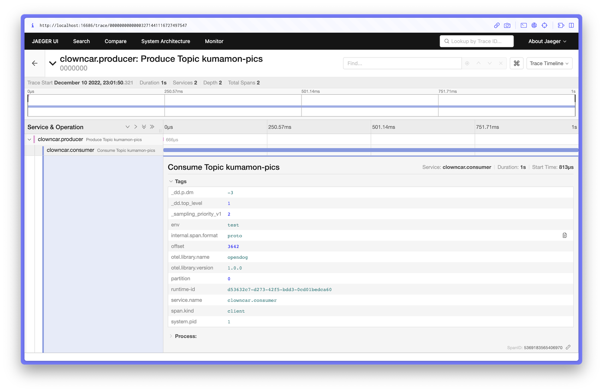

# Opendog

A hacky translation layer that converts Datadog traces into OpenTelemetry Protobufs for use with Jaegar

It's not perfect and there is a bunch of stuff to be implemented and tidied up but it's good enough to pipe Datadog traces locally into [Jaegar All In One](https://www.jaegertracing.io/docs/1.39/getting-started/#all-in-one)

## Usage

```console
$ go run .
2022/12/10 23:01:45 Opendog is listening on 127.0.0.1:8126
2022/12/10 23:01:46 Succesfully converted and forwarded 2 spans
2022/12/10 23:01:46 Succesfully converted and forwarded 2 spans
```

Your Datadog APM client will automatically connect if it is running on localhost.

If you'd like to point a container at it using Docker, you can set the following environment variable against your container:
* Windows/macOS: `DD_AGENT_HOST=host.docker.internal`
* Linux: `DD_AGENT_HOST=172.17.0.1`

Eventually it'll be packaged up properly, provide a docker container etc etc

## Variables

There are two environment variables that can be used for configuring Opendog

| Name                | Default Value                   | Notes                                                                                                              |
| ------------------- | ------------------------------- | ------------------------------------------------------------------------------------------------------------------ |
| `COLLECTOR_ADDRESS` | http://localhost:4318/v1/traces | The address to send gRPC payloads to. In this case, 4318 is the OTel endpoint used by Jaeger.                      |
| `PORT`              | 8126                            | The address to receive traces on. In this case, 8126 is the default traces port for the Datadog agent (aka statsd) |

## Example of Datadog traces piped into Jaegar



## Running Jaegar All In One

A reminder to myself because I'm going to forget

```console
$ docker run -d --name jaeger \
  -e COLLECTOR_ZIPKIN_HOST_PORT=:9411 \
  -e COLLECTOR_OTLP_ENABLED=true \
  -p 6831:6831/udp \
  -p 6832:6832/udp \
  -p 5778:5778 \
  -p 16686:16686 \
  -p 4317:4317 \
  -p 4318:4318 \
  -p 14250:14250 \
  -p 14268:14268 \
  -p 14269:14269 \
  -p 9411:9411 \
  jaegertracing/all-in-one:1.39
```